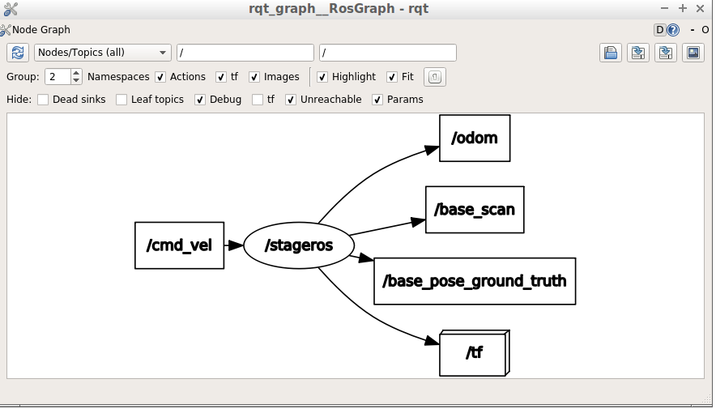

# Introducción a ROS como usuario

ROS (Robot Operating System) es un conjunto de bibliotecas y herramientas para ayudar a los desarrolladores de software crear aplicaciones robóticas. Proporciona una abstracción del hardware, de los controladores de dispositivos, las bibliotecas, visualizadores, paso de mensajes, gestión de paquetes y mucho más.

Ya habéis utilizado ROS en otras asignaturas así que nos limitaremos a dar un breve repaso de los conceptos en que se basa, sin explicarlos en profundidad.

A continuación veremos cómo ejecutar programas ROS en los simuladores y cómo funcionan los nodos y topics de ROS. De momento no veremos cómo programar en ROS ya que lo dejamos para sesiones posteriores.

## Conceptos básicos

- Tópico (*topic*): Son canales de información entre los nodos. Un nodo puede emitir o suscribirse a un tópico. Por ejemplo, stage (simulador de robots) emite un tópico que es la odometría del robot. Cualquier nodos se puede suscribir. El nodo que emite no controla quién está suscrito. La información es, por tanto, unidireccional (asíncrona). Si lo que queremos es una comunicación síncrona (petición/respuesta) debemos usar servicios. Un tópico no es más que un mensaje que se envía. Podemos usar distintos tipos de clases de mensajes.
- Paquete (*package*): El software en ROS está organizado en paquetes. Un paquete puede contener un nodo, una librería, conjunto de datos, o cualquier cosa que pueda constituir un módulo. Los paquetes pueden organizarse en pilas (stacks).
- Nodo (*node*): Un nodo es un proceso que realiza algún tipo de compu- tación en el sistema. Los nodos se combinan dentro de un grafo, compar- tiendo información entre ellos, para crear ejecuciones complejas. Un nodo puede controlar un sensor láser, otro los motores de un robot y otro la construcción de mapas.
- Pila (*stack*): Conjunto de nodos que juntos proporcionan alguna funcionalidad. Por ejemplo, la *pila de navegación* sirve para que el robot pueda moverse a un punto del mapa por la ruta más corta y evitando obstáculos por el camino.

## Probando ROS en el simulador

Probar una aplicación por primera vez en un robot real suele ser problemático, ya que depurar el código es complicado y además el  robot podría sufrir daños si el código no funciona correctamente . Por eso la práctica habitual es probar el código primero en un simulador y luego trasladarlo al robot real cuando estamos razonablemente seguros de que va a funcionar.

ROS está integrado con diversos simuladores. Nosotros usaremos dos distintos:

- **Stage**: es un simulador 2D, útil porque consume pocos recursos y es suficiente para ciertos casos. Por ejemplo un robot cuyo sensor principal sea un láser o un anillo de sonares básicamente obtiene información 2D del mundo.
- **Gazebo**: es un simulador multirobot de entornos 3D, mucho más realista que stage, aunque también consume muchos más recursos computacionales.

### El simulador Stage

Para ejecutar el simulador necesitamos un fichero de definición de mundo en el que se especifique cómo es el entorno (dimensiones, paredes, obstáculos) y el robot (dimensiones físicas y sensores). En la web de la asignatura podéis descargar un ejemplo de mundo en un zip que hay que descomprimir. 

El fichero de definición del mundo propiamente dicho es el `.world`. Además hay un fichero con un *bitmap* (en este ejemplo un `.pgm`) en el que se define el espacio vacío/ocupado.

Para ejecutar *stage* con el ejemplo, teclear en una terminal (desde el mismo directorio donde hayáis descomprimido el `.zip`):

```bash
roscore &
rosrun stage_ros stageros ejemplo.world
```

Debería aparecer una ventana 2D con el mundo simulado. Si veis el `ejemplo.pgm` notaréis que es realmente el mapa del mundo. En el `.world` se especifican sus dimensiones en metros y las del robot junto con los parámetros físicos del robot y de los sensores.

#### Viendo topics en modo texto

Por supuesto un robot no ve directamente el entorno, sea real o simulado, sino que lo percibe indirectamente a través de sus *sensores*. Como todo en ROS, la información de los sensores es accesible a través de ciertos *topics* en los que Stage publica la información. Abre una terminal aparte (para que el simulador siga ejecutándose en la anterior) y escribe:

```bash
rostopic list
```
Veremos una lista de *topics* publicados. Por ejemplo `/odom` es la odometría del robot, un sensor que nos dice en qué coordenadas se encuentra con respecto al punto inicial del que partió. Como todavía el robot no se ha movido, si imprimes los mensajes de este *topic* deben indicar que está en la posición `0,0,0)`. Pruébalo con:

```bash
#con el -n 1 imprimimos solo un mensaje 
#para que no se nos llene la pantalla de datos
rostopic echo /odom -n 1
```
#### Viendo el  grafo de nodos con `rqt_graph`

Para ver la información de modo gráfico puedes usar la orden `rqt_graph`. Pruébala, verás que solo aparece un nodo, para que aparezca el resto como en la siguiente figura tendrás que:

- En el desplegable donde pone `Nodes only` cambiarlo por `Nodes/topics (all)` y darle al botón de recargar (con la flecha circular) 
- En la opción de `Hide` desmarcar las casillas `Dead sinks` y `Leaf Topics`, así puedes ver los nodos que reciben pero no publican mensajes y los que publican pero no reciben, respectivamente



#### Publicando *topics* manualmente

En el grafo de nodos y *topics* habrás visto un *topic* llamado `/cmd_vel`. En este *topic* están escuchando los "motores" del robot, y si publicamos en él estaremos por tanto moviéndolo. En la terminal ejecuta:

```bash
rostopic info /cmd_vel
```
Para ver de qué tipo es el *topic*. Verás que nos dice quién lo publica, quién  está suscrito y de qué tipo es el mensaje. En ROS hay una serie de tipos de mensajes predefinidos y también  el programador se puede definir los suyos propios. En nuestro caso el tipo es `geometry_msgs/Twist`. Ahora para ver información sobre qué datos componen un mensaje de ese tipo, escribe en la terminal:

```bash
rosmsg show geometry_msgs/Twist
```

verás que te dice que un mensaje de este tipo está compuesto de 2 vectores 3D con componentes llamados `x`, `y`, `z`. El primer vector se llama `linear` y representa la velocidad lineal y el segundo `angular` y como es lógico representa la velocidad angular.

Normalmente se haría por código pero también podemos mover al robot publicando mensajes de manera manual. Prueba:

```bash
rostopic pub -r 10 /cmd_vel geometry_msgs/Twist  '{linear:  {x: 0.2, y: 0.0, z: 0.0}, angular: {x: 0.0,y: 0.0,z: 0.0}}'
```

El `-r 10` lo que hará es publicar el mensaje 10 veces por segundo. Verás que el robot empieza a moverse hacia el frente (eje X) a una velocidad de 0.2 m/s. El comando se quedará ejecutando (y el robot moviéndose, si no choca) hasta que pulses `Ctrl-C` para pararlo.

#### Viendo topics en modo gráfico: la herramienta RViz

Entre los topics que publica el simulador, `/base_scan` es el sensor de rango del robot. En el `.world` de ejemplo se define un sensor de tipo *laser scan* que da las distancias a los objetos más cercanos en un sector de 270 grados. Podemos ver la información en modo numérico en la terminal con 

```bash
rostopic echo /base_scan
```

No obstante ver impresa la lista de números con las distancias no es muy intuitivo. En general es mucho mejor visualizar la información de los sensores en modo gráfico. Para ello disponemos en ROS de la herramienta `rviz`.

```bash
rosrun rviz rviz
```

Al entrar en `rviz` lo primero es **cambiar en el panel izquierdo la opción `fixed frame` en las `Global Options`**. Este es el sistema de coordenadas que usará `rviz` para dibujar. Ahora está puesto a `map` y da un error porque eso sería para un mapa construido por el robot, cosa que no se ha hecho (lo haremos en una práctica posterior). Lo podéis cambiar por cualquiera de las otras opciones que sale al seleccionar el desplegable a la derecha de `fixed frame`, por ejemplo `odom`.

Podemos visualizar el sensor de rango añadiendo un nuevo *display* de tipo *Laserscan* (botón `Add` de la parte inferior del panel izquierdo). Una vez añadido hay que cambiar la opción `topic` para que se corresponda con el que está publicando el robot, en este caso `base_scan`. Debería aparecer dibujado en rojo el entorno que rodea al robot.

### El simulador Gazebo

[Gazebo](http://gazebosim.org) es un simulador 3D mucho más avanzado que Stage, y es el que necesitaremos para poder simular sensores como cámaras o cámaras RGBD (que detectan la profundidad, tipo kinect) o simular efectos físicos como `choques` o empujar objetos.

Ya que estamos, vamos a lanzar gazebo para simular uno de los robots que tenemos en el laboratorio, un turtlebot 2. Para eso haremos uso del *package* `turtlebot_gazebo`: 

```bash
roslaunch turtlebot_gazebo turtlebot_world.launch
```

Podemos mover al robot mediante el teclado con `turtlebot_teleop`

```bash
roslaunch turtlebot_teleop keyboard_teleop.launch
```

Si lanzáis la herramienta `rviz` como lo hacíamos con stage podréis ver gráficamente la información de los sensores del robot simulado.

```bash
rosrun rviz rviz
```