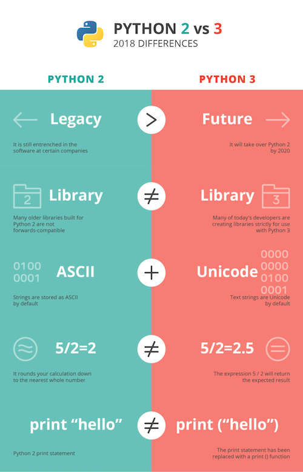

# Introducción básica al lenguaje  Python 


## Ideas iniciales

- Es un lenguaje interpretado, no compilado. Se parece a Javascript o Ruby, no mucho a Java/C
- De la versión 2 a la version 3 hubo un cambio importante con incompatibilidades



> En ROS1, hasta la versión Melodic inclusive se usa **Python 2** (por  tanto también en la que usamos, **Kinetic**). Noetic ya usa Python 3, lo que hace que el código Python sea incompatible con las versiones anteriores de ROS

## Comentarios "mágicos"

- Al principio del archivo, tienen  diversas funcionalidades, por ejemplo especificar el intérprete que se usará para ejecutar el código o el juego de caracteres

```python
#!/usr/bin/env python
# -*- coding: utf-8 -*-
```

## Variables y tipos básicos

- las variables no se declaran, se pueden inicializar directamente

```python
a = 'Hola'
```

- Las variables pueden cambiar de tipo dinámicamente. Para saber el tipo actual de una variable, `type(variable)`

```python
a = 'Hola'
a = 1  #válido
```

- ¿Cómo es esto posible?. A diferencia de lenguajes como C, donde una variable tiene una dirección de comienzo en memoria y un número fijo de bytes reservados, y por tanto no puede cambiar de tipo, en Python las variables en realidad son punteros

- números y operadores
    + operadores aritméticos: idem a C, exponenciación `**`
    + operadores comparación idem a C (`==, !=, <= ,...`)
    + cuando no se pone el punto decimal se usa aritmética entera, como en C: `7/2==3` (**esto ya no es así en Python 3**)

- tipo booleano
    - valores literales `True` y `False`
    - operadores booleanos: `and`, `or`, `not`

- Cadenas de caracteres
    - Delimitadas por comillas simples o dobles
    - Concatenar con `+`
    - Subíndices `[posicion]`. Empiezan en 0. Si es negativo es desde el final de la cadena
    - Obtener la longitud con la función `len(cadena)`
    - Las cadenas no son modificables, no podemos hacer por ejemplo `cadena[1]='a'`
    - *slice*: `[comienzo:final]` (la pos. final no se incluye en el slice). Se puede omitir comienzo y/o final. Gracias a que la pos final no se incluye, la cadena es `cadena[:pos]+cadena[pos:]``
  
## Colecciones

### Listas: 

* Tamaño dinámico y tipo heterogéneo
* literales: `a = [1, 2, 3]` `b=[1, 'hola']`
* Notación de array (`[i]`) para acceder a una posición, los *slices* funcionan
* Concatenar listas con `+`
* Obtener la longitud con `len(lista)`
* Algunos métodos útiles:
    + `lista.append(elemento)`: añadir al final
    + `lista.insert(pos, elem)`
    + `lista.index(elem)` obtener pos. del elemento
    + `lista.remove(elem)` buscar y eliminar elemento (si aparece varias veces se elimina solo la primera)
    + `lista.pop()` eliminar el elemento del final. `lista.pop(pos)` eliminar el elemento en la posición `pos`

### Tuplas

- parecidas a las listas, pero inmutables
- literales con comas entre los valores, y típicamente paréntesis

```python
mitupla  = (1, "hola", 27)
```
- se puede usar *slicing*
- se usan mucho como valores  de retorno de una función, así podemos devolver "más de un valor" (en realidad una tupla)
 
### Diccionarios

- conjunto de pares clave:valor

```python
beatles = {"bateria":"Ringo", "bajo":"Paul", "guitarra1":"John", "guitarra2":"George"}]
print beatles["bateria"]
beatles["bajo"] = "Sid"
```
- como clave se puede usar cualquier valor inmutable, las claves no se pueden cambiar, solo los valores
- no hay *slicing*

## Control de flujo

> IMPORTANTE: la indentación no solo es recomendable como en otros lenguajes, en Python es **necesaria** para que el código funcione


```python
if condicion:
   sentencia1
   ...
else:
   ...
   ...
```

```python
if condicion:
   sentencia1
   ...
elif condicion2:
   ...
   ...
else
   ...
```

```python
while condicion:
   sentencia1
   ...
```

```python
for elemento in secuencia:
   print elemento
   ...
```

```python
lista = [1,2,3,4]
for i in range(1,5):  #si fuera range(5) empezaría en 0
   print lista[i].    #imprimirá 2, 3, 4 (ya que empieza en la pos 1 y el range llega a pero no incluye el límite superior)
   ...
```

## Funciones 

```python
def incremento(valor, inc):
  return valor+inc
```

- "parecido" a C pero los parámetros no tienen tipo definido ni se define el tipo de retorno de la función
- parámetros con valores por defecto: `def incremento(valor, inc=1):`


## ¿Paso por valor o por referencia?

- ¿Qué pasa cuando asignamos una variable a otra o la pasamos como parámetro y luego modificamos la otra variable o el parámetro, se modifica el original o no?. Por ejemplo

```python
a = 1
b = a
b = 2 #¿Qué sucede con el valor de a?
```

O por ejemplo

```python
def modificar(valor):
   valor = valor + 1
   print valor

a = 1
modificar(a) #¿Qué sucede con el valor de a?  
```

- como las variables son referencias, asignar un nuevo valor a una variable solo afecta a esta variable, hace que referencie a un nuevo objeto (a una nueva zona de memoria)
- no obstante hay objetos que se pueden modificar parcialmente, o dicho de otro modo son *mutables* como las listas. En ese caso modificar parte del objeto afectará a todas las referencias a él. Por ejemplo

```python
lista = [1, 2]
copia = lista
copia[0] = "hola" #lista y copia referencian al mismo objeto, por tanto contienen ["hola", 2]
```

## Excepciones

- `try...except` es como el `try...catch` de C++

[Ejemplo *online*](https://repl.it/@ottocol/ZanyLividAttributes)

## Orientación a objetos

[Ejemplo *online*](https://repl.it/@ottocol/InfamousAnchoredSampler)

Cosas interesantes del ejemplo anterior:

- los métodos son simplemente funciones dentro del cuerpo de la clase
- el constructor es el método llamado `__init__`
- para construir objeto no hace falta poner `new`, solo el constructor  pero ya hemos visto que todos los objetos son referencias (como `new` en C++)
- todos los métodos reciben como primer parámetro `self`, que es como el `this` de C++. Este lo pasa python automáticamente, no lo pasamos nosotros

[Ejemplo *online* de herencia](https://repl.it/@ottocol/GrouchyRawPascal)

Cosas a destacar:

- Para especificar la clase de la que se hereda se pone entre paréntesis (si fueran varias, separadas por comas)
- Para llamar a un método de una superclase se pone `Superclase.metodo()`. Aquí si que hay que pasar el `self` explícitamente

## Módulos y paquetes

- importar módulos:

```python
import os, sys, time
print time.asctime()
```

- para importar al espacio de nombres global se usa `from <modulo> import <loquesea>`

```python
from time import asctime
print asctime()
```

- se pueden poner alias

```python
import time as t
print t.asctime()

from time import asctime as fechita
print fechita()
```

- físicamente un módulo no es más que un archivo en el directorio actual o en uno de los directorios en que Python busca automáticamente (`sys.path`). [Ejemplo *online*](https://repl.it/@ottocol/HealthyPhysicalMalware)

- **paquete**: colección de módulos. Si físicamente un módulo es un archivo, un paquete no es más que un directorio que contiene un fichero especial que se debe llamar `__init.py__`. No es necesario que contenga nada, puede estar vacío, simplemente es un "marcador" que indica que el directorio es un paquete. Puede tener subpaquetes, cada uno un directorio con su propio `__init.py__`, y para importar un módulo dentro haríamos `import paquete.subpaquete.modulo`

## Referencias

### Tutoriales

- [Intro de un ciclo de  FP](http://www.mclibre.org/consultar/python/)
- [Tutorial oficial en castellano](http://docs.python.org.ar/tutorial/2/contenido.html)

### Cheatsheets

- [En castellano](https://recursospython.com/wp-content/uploads/2014/05/python_cheat_sheet_es.pdf)
- [En inglés, del libro "Python Crash Course"](https://github.com/ehmatthes/pcc/releases/download/v1.0.0/beginners_python_cheat_sheet_pcc.pdf). Hay muchas otras más especializadas en [funcionalidades concretas](http://ehmatthes.github.io/pcc/cheatsheets/README.html) de Python

### Libros gratuitos y libremente accesibles

- [Curso: Python para principiantes](https://www.iaa.csic.es/python/curso-python-para-principiantes.pdf) PDF bastante detallado
- [Python para todos](http://mundogeek.net/tutorial-python/)