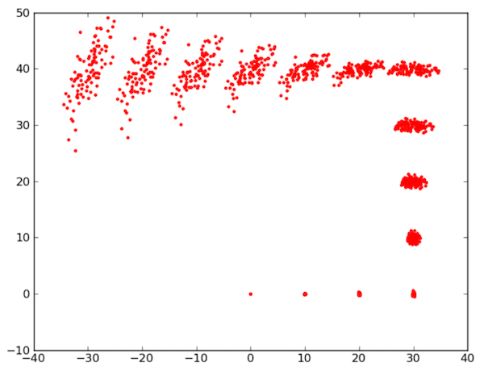

# Práctica 2 de Robots Móviles 2020/21. Mapeado y localización

En esta práctica vamos a trabajar con varios algoritmos de localización y mapeado de robots móviles que iremos viendo en las sesiones teóricas.

La práctica tiene varias partes: para los requisitos mínimos no es necesario que escribáis código, solo que probéis las funcionalidades ya implementadas en ROS. Para la mayoría de las partes adicionales tendréis que escribir algo de código.

> Se os da una plantilla hecha en Python para que os sirva como base. Podéis implementar las partes adicionales en C++ o en el lenguaje que queráis pero tendréis que apañároslas para conseguir un resultado similar (podéis crear los gráficos con Matlab o como queráis siempre que los datos hayan sido generados por vuestro código).

Para realizar los requisitos mínimos tendréis que consultar referencias adicionales, aquí no se va a explicar cómo crear mapas y localizarse en ROS ya que la idea es que encontréis la información vosotros mismos. No obstante en el [apéndice 1](#apendice_1) tenéis un par de referencias.


## Parte 1: Construcción de mapas del entorno (requisito mínimo)

En esta primera parte de la práctica nos centraremos en la generación de mapas 2D del entorno. Este mapa se utilizará posteriormente para la localización del robot. Utilizaremos los paquetes ya disponibles en ROS para la construcción de mapas. 

Para el manejo del robot puedes utilizar un nodo para la teleoperación del robot mediante teclado, o también puedes usar el código de la práctica 1 para mover el robot.

Prueba el mapeado como mínimo en un mundo de stage y uno de gazebo. Recuerda que el sensor simulado en Gazebo tiene mucha menos resolución y campo de visión que el simulado en stage. Pon en la documentación los mapas obtenidos y comenta los resultados: 

- ¿Podrías decir qué resolución tienen los mapas obtenidos? (está en el fichero del mapa, busca en internet dónde aparece esa información)
- ¿Qué tal funciona el algoritmo con el laser simulado y con la kinect simulada, hay diferencias?
- ¿Crees que hay cierto tipo de entornos en los que funciona mejor? (espacios abiertos, espacios pequeños, pasillos,...)
- El algoritmo de mapeado tiene una serie de parámetros, intenta hacer varias pruebas variando alguno de ellos para ver si eres capaz de deducir cómo influyen.
 
Para poder repetir una misma prueba variando los parámetros del algoritmo podéis grabar los datos de los sensores en un fichero  `rosbag`. Este `rosbag` se puede "reproducir" posteriormente las veces que haga falta como si fuera información que el robot está recibiendo "en vivo", pudiéndose así repetir un experimento varias veces con los mismos datos de entrada. Tenéis explicado el uso de `rosbag` en el [apéndice 2](#apendice_2)

> En `rosbag` si no quieres grabar todos los *topics* para ocupar menos espacio, asegúrate en Stage de grabar como mínimo el *topic* del laser (mira antes si es `/scan` o `/base_scan`) y además `/tf` (para que el algoritmo de mapeado pueda hacer la transformación de coordenadas). En Gazebo además tendrás que grabar `/tf_static`

## Parte 2: Localización (requisito mínimo)

En esta sección vamos a utilizar los mapas que hemos construido previamente. Utilizando estos mapas vamos a evaluar un algoritmo de localización ya implementado en ROS. De esta forma seremos capaces de localizar el robot sobre el mapa preconstruido utilizando para ello información de sus sensores.

Aquí también es recomendable realizar grabaciones en formato rosbag para poder trabajar offline y probar distintos parámetros del algoritmo elegido. 

Prueba la localización como mínimo en un mundo de stage y uno de gazebo. Explica cómo ha funcionado, si has encontrado casos en que falle, etc.

## Parte 3: Modelo de error del movimiento (requisito adicional, hasta 1 punto)

> Este apartado no podrás realizarlo hasta ver la teoría del 21 de octubre, donde explicaremos este modelo

Implementa el modelo de error basado en la odometría del robot y que usa muestras, que vimos en clase. El programa dibujará por pantalla la posición de las muestras en cada paso para una secuencia de movimientos del robot dada por las posiciones medidas por la odometría. El resultado será algo similar a esto:

 

Para llevar a cabo la implementación podeis utilizar [la plantilla](recursos_prac2/plantilla_practica2.zip) que os proporcionamos. Verás que es un .zip con código Python para que te sirva como punto de partida, y un fichero `.txt` cuyo uso veremos luego. 

En el código la clase `Pose` representa una posible posición del robot (\\(x,y,\theta)\\).

Para llevar a cabo el modelado del error tendrás que implementar las dos funciones principales: `sample_normal_distribution` y `sample_motion_model`

- En la función `sample_normal_distribution(b)` debes devolver una muestra de una distribución normal de media 0 y desviación típica `b`.
- En la función `sample_motion_model` debes implementar el algoritmo del mismo nombre que vimos en teoría (transparencia 28 del tema 3, parte I). Cuidado, a diferencia del algoritmo de teoría, que tiene como entrada \\(\delta_{rot1}, \delta_{rot2}, \delta_{trans}\\) la función Python recibe la `Pose` medida por la odometría en el instante actual y en el previo. A partir de estas dos `Pose`s puedes calcular los  \\(\delta\\)  (cómo calcularlos en la transparencia 14 del tema 3 parte I).

El programa recibe dos parámetros en línea de comandos:

1. Fichero de odometría: En la plantilla es el fichero `odometria.txt`. Ese fichero contiene las posiciones medidas por la odometría del robot. Cada línea tiene tres números \\( x,y,  \theta\\). Ya se os da implementado código Python que lee estos datos y los coloca en un array de objetos `Pose`
2. Número de muestras

Un ejemplo de ejecución del programa sería el siguiente:

```bash
python practica1.py odometria.txt 500
```

En el código debes ajustar los cuatro parámetros de error que vimos en clase de teoría, \\( \alpha_1, \alpha_2, \alpha_3, \alpha_4\\). Prueba el algoritmo utilizando distintas secuencias de odometría y distintos parámetros de error. Incorpora a la memoria las gráficas generadas y comenta brevemente el resultado obtenido para cada una de las secuencias.

## Parte 4: Modelo de error del sensor (requisito adicional, hasta 1 punto)

> Este apartado no podrás realizarlo hasta ver la teoría del día 28 de octubre, en la que explicaremos este modelo.

Implementa el modelo del sensor para un sensor basado en landmarks como el que se ha visto en clase, que detecte la distancia y orientación a un landmark. Supondremos resuelto el problema de la asociación de datos. Tendrás que implementar otro fichero .py con una función `sensor_model` de este estilo:

```python
def sensor_model(pose_robot, pose_landmark, d, alfa):
    """Devuelve la probabilidad de una medida del sensor, dada
    una pose del robot, del landmark medido en el mapa, la distancia
    medida y el ángulo medido
    Argumentos:
      pose_robot (Pose): posición actual del robot
      pose_landmark (Pose): posición en el mapa del landmark detectado
      d (float): distancia devuelta por el sensor
      alfa (float): ángulo devuelto por el sensor
    Devuelve
      float: probabilidad de la medida
    """
    #TODO: falta implementar la función
    return 0
```
Para probarlo haz un programa al que se le pueda pasar 5 argumentos float en línea de comandos con la pose del robot, del landmark, la distancia medida y el ángulo medido (ángulos en grados para que sea más intuitivo) e imprima en la consola la probabilidad.

## Entrega de la práctica

### Baremo

> Como su nombre indica **los requisitos mínimos deben realizarse obligatoriamente para poder aprobar la práctica**. Del resto de requisitos podéis elegir los que queráis. Tened en cuenta que todos los puntos que se proponen suman más de 10 por lo que no es necesario que los hagáis todos, ya que **en cada práctica no os puedo poner una nota superior al 10**.

- **Requisitos mínimos (hasta un 6)**: realización de las partes 1 y 2 de la práctica en el simulador. La práctica debe estar adecuadamente documentada, respondiendo como mínimo a las preguntas que se plantean y detallando los resultados de todos los experimentos realizados. 
- **(hasta 2 puntos adicionales)**: realización de las partes 3 y 4 de la práctica.
- **(hasta 2 puntos adicionales)**: implementar un algoritmo de localización con filtro de partículas usando las partes 3 y 4 de la práctica. Además de estas partes necesitaréis implementar el algoritmo en sí y un pequeño simulador que simule un robot  moviéndose por un entorno 2D en el que hay landmarks de los que puede detectar distancia y orientación. En cada momento se debe mostrar la diferencia entre la posición simulada y la obtenida por el filtro de partículas. No es necesario que el simulador sea gráfico, podría imprimir simplemente los datos numéricos en la consola.
- **(hasta 1 punto adicional)** tomar alguna implementación ya existente en internet de un algoritmo de localización o mapeado (sea o no de ROS), examinar el código fuente y detallar su funcionamiento, tanto del código en si (incluir comentarios indicando qué hace cada parte del código) como de las pruebas que  hayáis realizado sobre el mismo. Redactarlo en forma de tutorial para que pueda servir a otros compañeros que quieran probar la implementación y saber cómo funciona.
- Cualquier otra idea que se os ocurra relacionada con el mapeado y la localización. Consultad con el profesor para ver cuánto se podría valorar en el baremo.

### Formato de la documentación 

La documentación en un formato portable y multiplataforma como PDF o HTML. Podéis incluir videos capturados del simulador o del robot real o los ficheros rosbag de los experimentos.

### Plazos y procedimiento de entrega

La práctica se podrá entregar hasta las 23:59 horas del **martes 24 de Noviembre del 2020**.

La entrega se realizará a través del Moodle de la asignatura.

## <a name="apendice_1">Apéndice 1: Referencias</a>

Para realizar los requisitos mínimos necesitaréis consultar información adicional sobre localización y mapeado en ROS, ya que en clase no vamos a explicarlo.

Si tenéis el simulador de Turtlebot 2 podéis consultar estas referencias (no es obligatorio usarlas, podéis buscar otras):

- Para localización y mapeado en **Stage** los capítulos 9 y 10 del libro *"Programming Robots with ROS"*, de Quigley, Gerkey y Smart, ed. O'Reilly, 2015. Podéis [consultarlo *online*](https://www.oreilly.com/library/view/programming-robots-with/9781449325480/?ar) por medio de los servicios de la biblioteca de la UA. Si es la primera vez que entráis os preguntará de qué Universidad sois y os pedirá el email de la UA, para poder dar de alta vuestro usuario en el servicio.
- Para **Gazebo** podéis seguir por ejemplo [este tutorial online](https://learn.turtlebot.com/2015/02/03/8/).

Si en vuestra máquina tenéis otro simulador de otro robot instalado (por ejemplo Turtlebot 3) tendréis que buscaros otras referencias ya que las instrucciones anteriores no os servirán directamente (aunque al menos en el caso del Turtlebot 3 encontraréis bastante información).

Como ya se ha dicho, podéis consultar la información de referencia que queráis, sean libros, tutoriales online, videos...siempre que la referenciéis en la documentación.

> Como recomendación general, fijaos en que la biblioteca de la UA tiene disponibles muchos [libros en formato electrónico](https://ua.on.worldcat.org/search?databaseList=1953%2C1931%2C1875%2C1941%2C2259%2C2237%2C3313%2C2375%2C239%2C2570%2C638%2C2260&queryString=ros+robots&clusterResults=true) sobre ROS.

## <a name="apendice_2">Apéndice 2: uso de `rosbag`</a>

El paquete `rosbag` es un conjunto de herramientas para grabar y reproducir topics en ROS. Proporciona una herramienta de línea de comandos llamada `rosbag` para trabajar con *bags*, así como APIs de código para leer/escribir estas grabaciones en C++ y Python.

A continuación se muestra la lista de operaciones soportadas por el comando `rosbag`:

- record: Graba en un fichero bag el contenido de los topics especificados.
- info: Muestra un resumen del contenido de un fichero bag. 
- play: Reproduce el contenido de uno o más ficheros bag.
- check: Comprueba si el fichero bag es reproducible en el sistema actual o si puede ser migrado a otro sistema.
- fix: Repara los mensajes en un fichero bag de forma que se pueda repro- ducir en el sistema actual.
- filter: Convierte un fichero bag utilizando expresiones de Python. compress: Comprime uno o más ficheros bag.
- decompress: Descomprime uno o más ficheros bag.
- reindex: Reindexa uno o más ficheros bag que esten corruptos.

### Grabación de datos

Esta sección muestra como grabar datos de los *topics*. Todos los datos de los *topics* que grabemos se acumularán en un fichero bag.

Veamos un ejemplo usando el paquete  `turtlesim` que nos permite controlar una especie de "tortuga" en pantalla. Ejecutaremos los siguientes comandos en distintas terminales:

```bash
roscore
rosrun turtlesim turtlesim_node
rosrun turtlesim turtle_teleop_key
```

Esto iniciará dos nodos - el nodo visualizador y un nodo que permite el control por teclado del robot usando las teclas de flechas en el teclado. Si seleccionas la ventana de terminal desde la que lanzó turtle_keyboard, deberías ver algo como lo siguiente:

```bash
 Reading from keyboard
---------------------------
Use arrow keys to move the turtle.
```

Presionando las flechas del teclado el robot turtlebot se moverá por la panta- lla. Ten en cuenta que para mover el robot debes tener seleccionada la terminal desde la que lanzaste a Turtlesim y no la ventana de Turtlesim.
En caso de que ya tuvieses el robot real funcionando u estuvieses utilizando otros nodos que publican datos no es necesario la ejecución de los comandos anteriores.

### Grabación de todos los topics

Primero vamos a examinar la lista completa de topics que están siendo pu- blicados en el sistema en ejecución. Para ello, abre un nuevo terminal y ejecuta el comando:

```bash
rostopic list -v
```

si has ejecutado el Turtlesim anteriormente deberías ver la siguiente salida por pantalla:

```bash
Published topics:
* /turtle1/color_sensor [turtlesim/Color] 1 publisher
* /turtle1/cmd_vel [geometry_msgs/Twist] 1 publisher
* /rosout [rosgraph_msgs/Log] 2 publishers
* /rosout_agg [rosgraph_msgs/Log] 1 publisher
* /turtle1/pose [turtlesim/Pose] 1 publisher
Subscribed topics:
* /turtle1/cmd_vel [geometry_msgs/Twist] 1 subscriber
* /rosout [rosgraph_msgs/Log] 1 subscriber
```

La lista de topics publicados es el único tipo de mensaje que podría gra- barse en el archivo de registro de datos, ya que sólo se graban los mensajes publicados. El tema /turtle1/cmd_vel es el mensaje de comando publicado por teleop_turtle que es tomado como entrada por el proceso turtlesim. Los mensajes /turtle1/color_sensor y /turtle1/pose son mensajes de salida publicados por turtlesim.

Ahora grabaremos los datos publicados. Abre una nueva ventana de terminal. En esta ventana ejecuta los siguientes comandos

```bash
mkdir bagfiles
cd bagfiles
rosbag record -a
```
con estas intrucciones estamos creando un directorio temporal para grabar los datos y luego ejecutando el comando `rosbag` con la opción `-a`, indicando que todos los temas publicados deben ser acumulados en un archivo bag.

Vuelve a la ventana del terminal con `turtle_teleop` y mueve el robot durante unos 10 segundos. En la ventana que ejecuta `rosbag record` pulsa Ctrl-C para terminar la grabación. Ahora examina el contenido del directorio `bagfiles`. Deberías ver un archivo con un nombre que comience con el año, la fecha, la hora y el sufijo `.bag`. Este es el archivo que contiene todos los datos publicados por cualquier nodo en el momento en que se estaba ejecutando el comando `rosbag record`.

### Grabar solo algunos *topics*

Dado que pueden haber muchos topics publicando información, puede desearse grabar solo cierta información publicada por algunos topics. Por ello es posi- ble especificar al comando `rosbag record` los topics en particular que se desean grabar.

```bash
rosbag record -O subset /turtle1/cmd_vel /turtle1/pose
```

El argumento `-O` le dice al comando `rosbag` que se grabe en un archivo llamado `subset.bag`, y los argumentos del comando hacen que sólo se suscriba a estos dos temas. Mueva el robot en el simulador durante varios segundos usando los comandos de flecha del teclado, y luego pulsa Ctrl-C para terminar la grabación.

### Examinando ficheros bag

Ahora que sabemos como grabar un archivo *bag* po demos examinarlo y reproducirlo usando los comandos `rosbag info` y `rosbag play`. Primero vamos a ver lo que está registrado en el archivo *bag*. 

Podemos ejecutar el comando `rosbag info` – este comando comprueba el contenido del archivo bag sin reproducirlo. Ejecuta el siguiente comando desde el directorio *bagfiles*:

```bash
rosbag info <your bagfile>
```

Deberías ver algo como lo siguiente:

```bash
path: 2014-12-10-20-08-34.bag
version: 2.0
duration: 1:38s (98s)
start: Dec 10 2014 20:08:35.83 (1418270915.83)
end: Dec 10 2014 20:10:14.38 (1418271014.38)
size: 865.0 KB
messages: 12471
compression: none [1/1 chunks]
types:       geometry_msgs/Twist [9f195f881246fdfa2798d1d3eebca84a]
rosgraph_msgs/Log [acffd30cd6b6de30f120938c17c593fb]
turtlesim/Color [353891e354491c51aabe32df673fb446]
turtlesim/Pose [863b248d5016ca62ea2e895ae5265cf9]
topics: /rosout  4 msgs : rosgraph_msgs/Log   (2 connections)
/turtle1/cmd_vel      169 msgs  : geometry_msgs/Twist
/turtle1/color_sensor 6149 msgs : turtlesim/Color
/turtle1/pose         6149 msgs : turtlesim/Pose
```
Esto nos indica los nombres y tipos de *topics*, así como el número de mensajes de cada topic contenidos en el archivo bag. Podemos ver que de los temas que se anunciaron que vimos en la salida del rostopic, cuatro de los cinco fueron publicados realmente sobre nuestro intervalo de grabación. Mientras corríamos el comando `rosbag` con el parámetro `-a`, grababa todos los mensajes publicados por todos los nodos.

### Reproduciendo ficheros bag

Al reproducir un fichero bag se están volviendo a enviar los mismos mensajes que en la situación original, podemos emplear esta funcionalidad para ejecutar pruebas siempre con la misma secuencia de datos de entrada.

Primero mata el programa de teleoperación que puede estar todavía ejecutándose desde la sección anterior - Ctrl-C en la terminal donde iniciaste `turtle_teleop_key`. Deja a Turtlesim corriendo. En una ventana de terminal ejecuta el siguiente comando en el directorio donde grabaste el archivo bag original:

```bash
rosbag play <your bagfile>
```

En esta ventana deberías una salida como la siguiente:

```bash
 [ INFO] [1418271315.162885976]: Opening 2014-12-10-20-08-34.bag
Waiting 0.2 seconds after advertising topics... done.
Hit space to toggle paused, or 's' to step.
```

Una opción interesante del comando `rosbag play` es el parámetro `-r`. Esta opción nos permite especificar la frecuencia de la publicación de mensajes.

```bash
rosbag play -r 2 <your bagfile>
```

Con el comando anterior estamos publicando los mensajes al doble de velocidad de como se grabaron.

